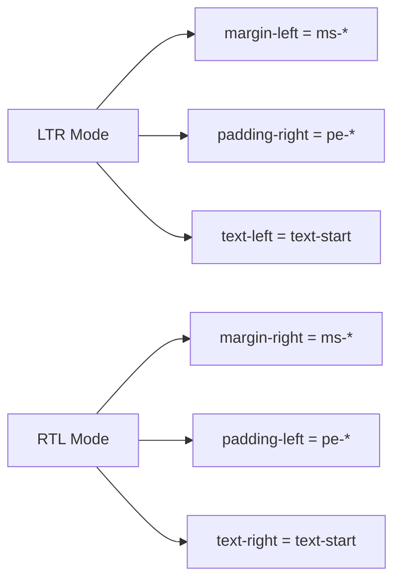

## Why We Need to Replace Standard Tailwind Directional Classes with Logical Properties

Based on the backlog documentation and your project's current i18n implementation, here's why this change is critical:

### 1. **RTL Language Support**

Your project already supports RTL languages like Arabic (ar) and Kurdish (ku) - as seen in [`src/lib/i18n/locales/ar/`](src/lib/i18n/locales/ar) and [`src/lib/i18n/locales/ku/`](src/lib/i18n/locales/ku). When users switch to these languages, the layout should automatically mirror horizontally.

### 2. **How Logical Properties Work**

Standard physical directional classes are tied to physical directions:

- `ml-*` (margin-left) - always on the left side
- `pr-*` (padding-right) - always on the right side
- `text-left` - always aligns text to the left

Logical properties adapt based on the writing direction:

- `ms-*` (margin-inline-start) - start of the line in the writing direction
- `pe-*` (padding-inline-end) - end of the line in the writing direction
- `text-start` - start of the text block in the writing direction

### 3. **Current State**

Looking at [`src/styles/index.css`](src/styles/index.css:1), the project uses Tailwind v4 with `@import 'tailwindcss'`. Tailwind v4 has built-in logical property support via the [`text-start`](src/styles/index.css), [`ms-*`](src/styles/index.css), [`me-*`](src/styles/index.css), [`ps-*`](src/styles/index.css), [`pe-*`](src/styles/index.css) classes.

However, **existing component code may still use physical directional classes** which won't mirror correctly in RTL mode.

### 4. **The Problem Demonstrated**

When switching from English (LTR) to Arabic (RTL):

| Physical Class | LTR Behavior   | RTL Behavior (WRONG)    |
| -------------- | -------------- | ----------------------- |
| `ml-4`         | margin on left | margin still on left ❌ |
| `text-left`    | text on left   | text still on left ❌   |

| Logical Class | LTR Behavior   | RTL Behavior (CORRECT) |
| ------------- | -------------- | ---------------------- |
| `ms-4`        | margin on left | margin on right ✓      |
| `text-start`  | text on left   | text on right ✓        |

### 5. **Migration Required**

This task involves:

1. **Scanning codebase** for physical directional classes (`ml-`, `mr-`, `pl-`, `pr-`, `text-left`, `text-right`, `border-l-`, `border-r-`, etc.)
2. **Replacing** them with logical equivalents (`ms-`, `me-`, `ps-`, `pe-`, `text-start`, `text-end`, `border-s-`, `border-e-`)
3. **Testing** that layouts properly mirror when switching to Arabic/Kurdish

This ensures your RTL support works correctly end-to-end, providing a seamless experience for Arabic and Kurdish users without visual glitches.
